# Portfolio Project 1 - HTML/CSS Essentials
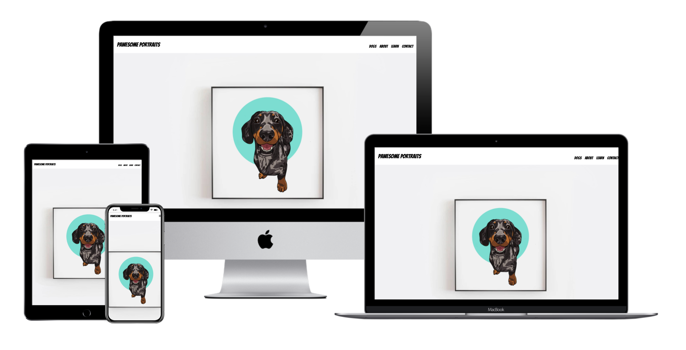

## Live Site 
[Pawsome Pawtraits](https://tashatj.github.io/pawsome-portraits-v4/)

## Repository 
[https://github.com/TashaTJ/pawsome-portraits-v4](https://github.com/TashaTJ/pawsome-portraits-v4)

***

## Contents
- [Key Project Goals](#key-project-goals)
- [Brief](#brief)
- [Target Audience](#target-audience)
- [UX User Experience](#ux-user-experience)
    - [User Stories](#user-stories)
    - [Initial Concept](#initial-concept)
    - [Wireframes](#wireframes)
    - [Site Structure](#site-structure)
    - [Colour Scheme](#colour-scheme)
    - [Typography](#typography)
    - [Imagery](#imagery)
- [Features](#features)
    - [Existing](#existing)
        -[Home](#home)
        -[Dogs](#dogs)
        -[About](#about)
        -[Learn](#learn)
        -[Contact](#contact)
        -[Form Confirmation](#form-confirmation)
    - [Future Features](#future-features)
- [Technologies Used](#technologies-used)
- [Testing](#testing)
- [Deployment](#deployment)
    - [To Fork the Repository](#to-fork-the-repository)
    - [To create a Local Clone](#to-create-a-local-clone)
- [Credits](#credits)
    - [Content](#content)
    - [Media](#media) 
    - [Code](#code)
- [Acknowledgements](#acknowledgements)

***

## Key Project Goals
This project has 2 main objectives: 
- To showcase a client’s graphic design portfolio in a compelling static front end application that’s simple to navigate and clear in it’s intention. 
- To demonstrate my competency as a developer using HMTL & CSS languages

## Brief
The website should promote Craig Kelly’s graphic design skills and the pet portraits he creates with them. Craig and I agreed the following features (in order of importance) would meet his needs: 
- A gallery of works 
- A brief explanation of the project and Craig's other work
- Tutorials for art enthusiasts 
- A contact form for enquiries and commissions 
- Links to his social media

## Target Audience
Dog lovers, Art enthusiasts, collaborators & customers. 

## UX: User Experience

## User Stories 

As a user I want to be able to:

- Understand the purpose of the site on loading
- Navigate through the site smoothly
- See lots of examples of artworks
- be able to contact Craig easily
- Learn more about Craig's process and perhaps learn some skills myself
- Connect with Craig on social media 
- Learn more about the developer who created the site

## Initial Concept
With such compelling visual content from the Artist, I want to create a minimal and sleek monochrome theme to allow the work to shine and not have to compete with the website design. I have often referred back to the [Apple website](https://www.apple.com/uk/) for inspiration. 

## Wireframes

The Wireframes were produced using [Balsamiq](https://balsamiq.com/). 
The final site varies from the wireframes due to developments that occurred during the building process. 

### Phone

Home Page:

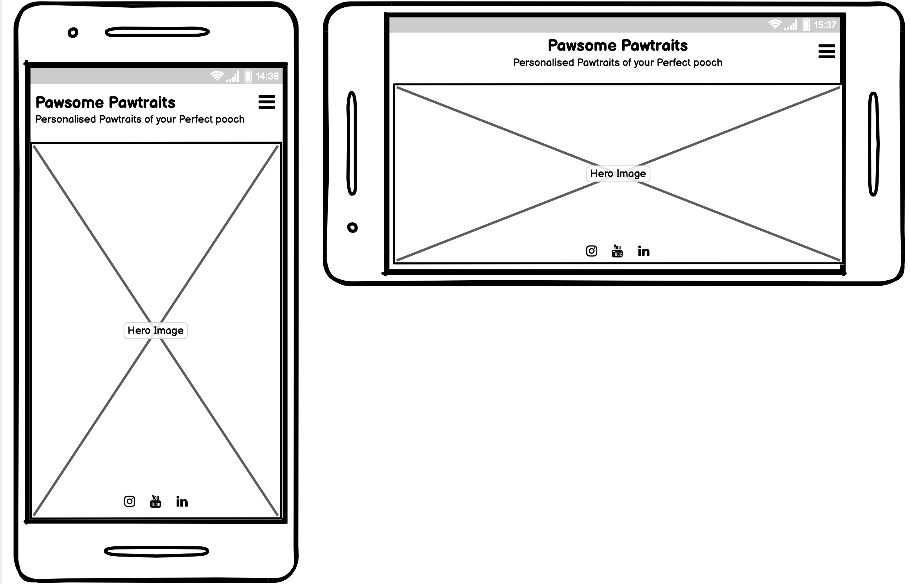

Gallery Page:

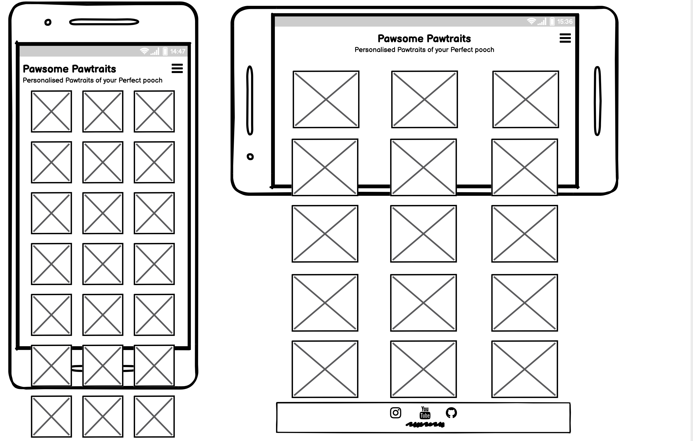

About Page:

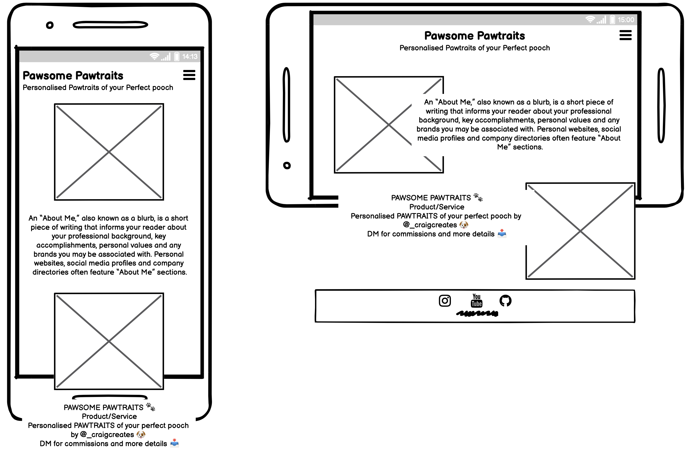

Learn Page:

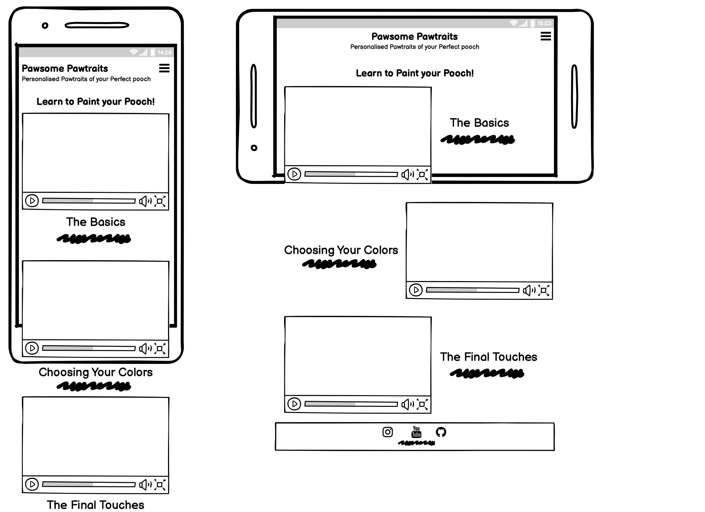

Contact Page:

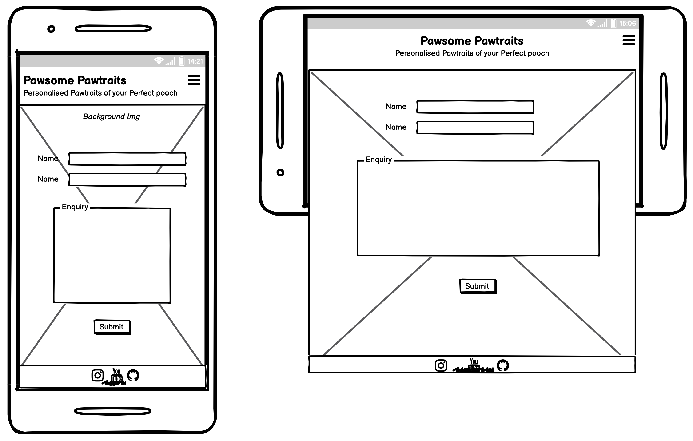

### Tablet 

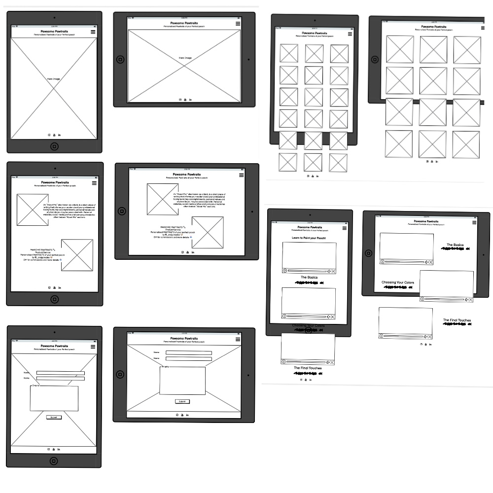

### Desktop 

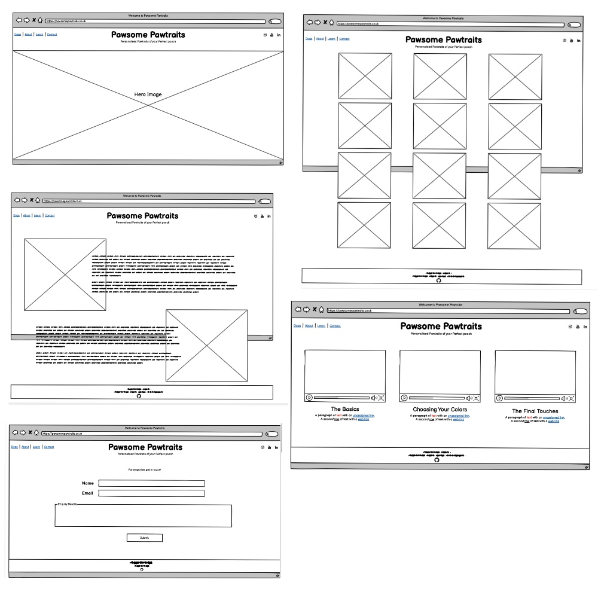

## Site Structure

Pawsome Portraits is a 5 page website. The home page is the default loading page. the other pages are accessible from the navigation menu. There’s also another link to the contact page in the about page, guiding the user to their next steps for a great user experience.  

## Colour Scheme

My colour scheme will take inspiration from the hero image including white, mellow gold, turquoise and black. These colours will form a strong monochrome base point for the website, allowing the vibrant colours of the artwork to ‘pop’.
I used [coolors.co](https://coolors.co/d3ab9e-eac9c1-ebd8d0-fffbff-fefeff) to generate some colour codes as inspiration for the site. After some experimentation I settled on some different shades of the original selection to ensure contrast was optimised for a good UX.

Original Colours: 

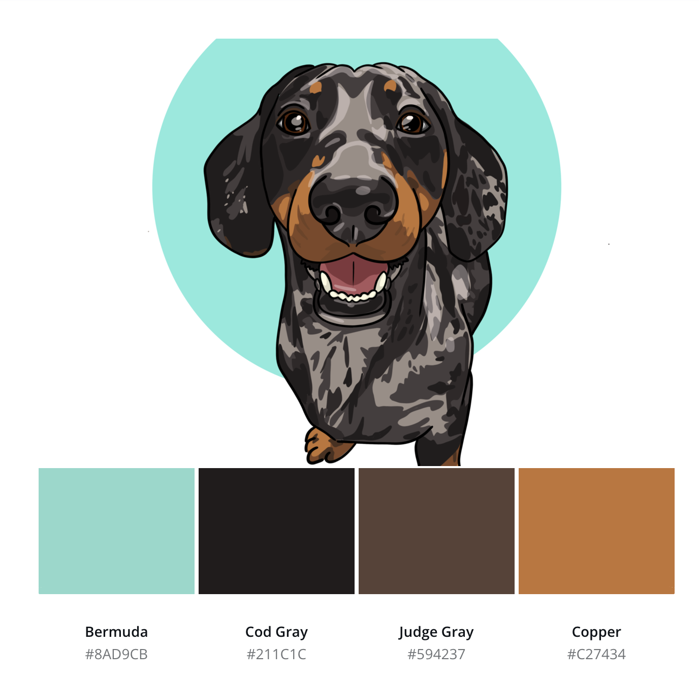

Final Colour Selection:

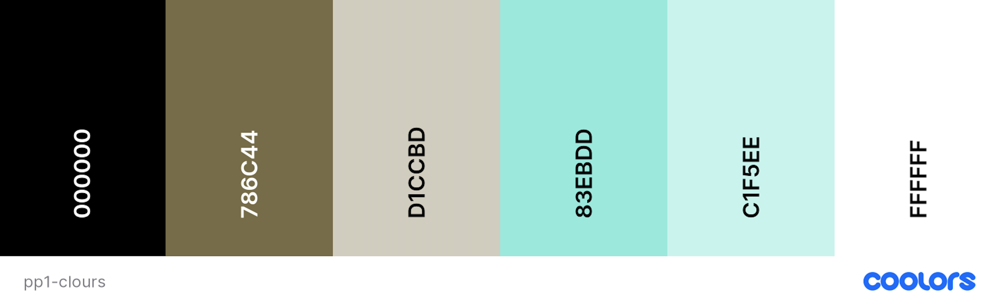

## Typography

The two fonts used were imported into the css from [google fonts](https://fonts.google.com/).
Bangers, for headings and titles, was chosen for it’s playful comic book nature, which compliments the cheeky character of the dogs brought about in the portraits themselves. 
Roboto, with it’s friendly, open curves continues this positive and welcoming theme into the paragraph text. 
Sans-serif is the nominated fallback font, due to it’s simplicity, therefore allowing it to integrate well into the site should the other fonts not load. 

## Imagery

The artwork is the main focus of the site and therefore features heavily within it. Many have been compressed in [compressor.io](https://compressor.io/) to enable faster loading times. 
The content images are aligned in neat symmetrical grids for optimal viewing and user experience. 

***

## Features

The site contains common features such as a navigational bar and footer, familiar to all internet users. This creates a friendly and non intimidating environment in which the user can feel comfortable to explore the pages, make return visits, and enjoy a positive user experience.

### Existing Features

#### Home

##### Navigational Bar 

Heading each page top, it’s fully responsive and toggles to a neat hamburger menu. It contains links to all pages, reachable at any time within the user's journey through the site. The Logo contains a link to the home page and when a page is active it is indicated by a change in colour from black to gold, both allowing enhanced UX. 

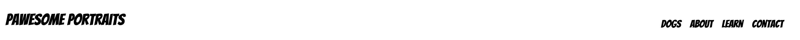

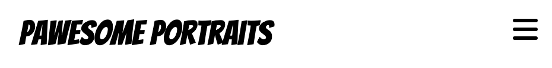

##### Footer 
Sat at the bottom of all pages, is the footer. It’s minimal in style and contains the centralised social media links, opening in separate tabs for a great UX. it also contains a link to the developer's GitHub portfolio, should the user be an employer wanting to experience more of their work.

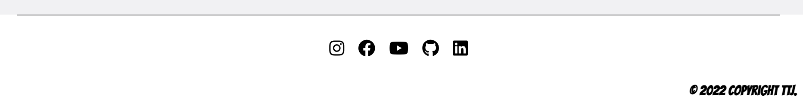

#### Dogs 

##### Gallery

The portraits are displayed in one simple and symmetrical gallery, with only white as their backdrop for maximum visual impact.

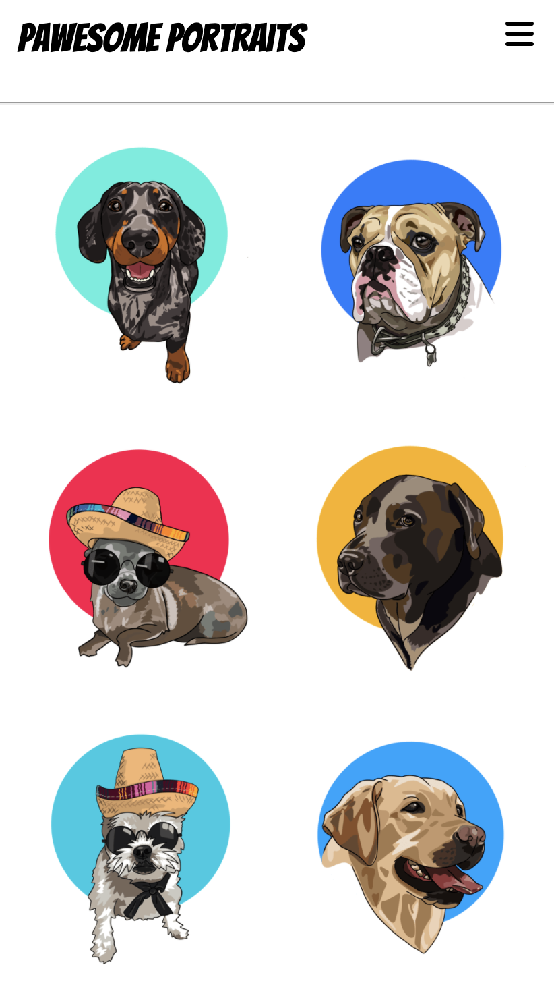

#### About

Via pictures and text placed on a fully responsive grid, users can get to know the man behind the artworks a little better. 
It contains a short blurb describing what the Pawtraits are and how the project began and links to Craig's other work, should interested parties want to investigate further.
All links open in new tabs for a positive user experience. It also contains a photo of Craig and another photo of his work in it's real life environment. I have treated the photos so they contain a white frame and therefore the website background white acts as a real life gallery wall which the pictures appear to hang from. 

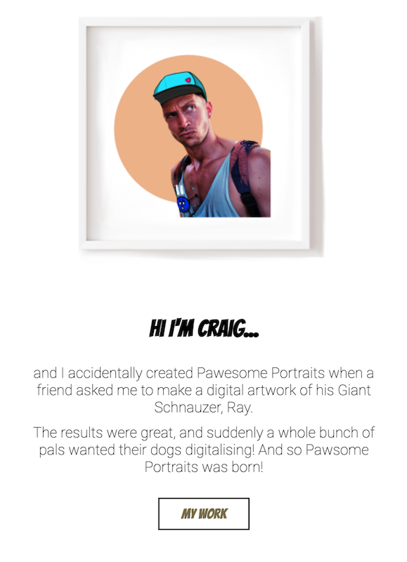

#### Learn

This page contains
- A 9 step responsive photo grid, demonstrating Craig's artistic process in 9 numbered steps. The numbers correspond with the text steps in the section below. The photos can be zoomed on click for great UX.

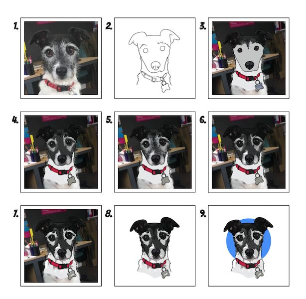

- 3 time-lapses of Craig’s artistic process during the creation of a pawtrait. They sit above their headings text explanations. These short and easy to play videos are embedded from youtube so the user can remain on the site while they watch for optimum UX. Autoplay play is also disabled for better UX. They are for educational purposes, to deepen a user's understanding of the artworks if desired.  

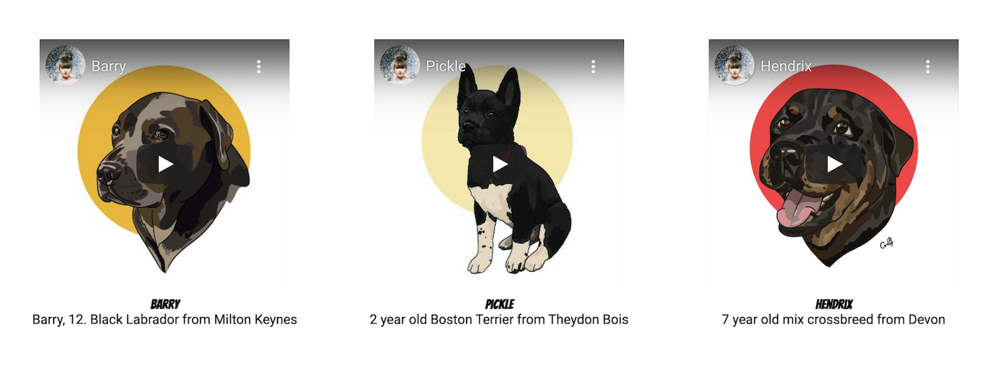

#### Contact

The contact page contains a simple and fully responsive form, by which users can contact Craig without having to leave the site. This page completes the user’s journey through the site and is designed to be calm, simple and reassuring, with 4 labelled inputs and a submit button styled in keeping with the rest of the site. The form is flanked by 2 pawtraits, acting as a visual sign off in keeping with the style of the site for great UX. The bottom of the page contains an address and map to Craig's studio should the user want to visit. 

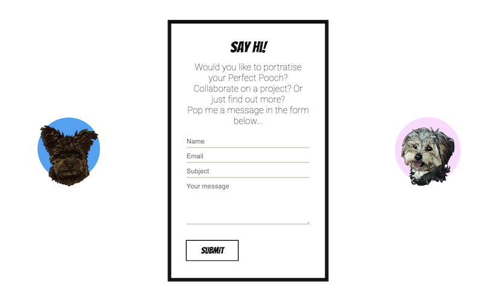

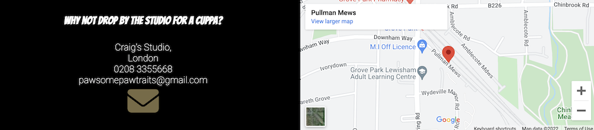

#### Form Confirmation

This page confirms details have been sent to Craig and provides a direct link back to the home page, as well as the header and footer. For this project it validates the form only.

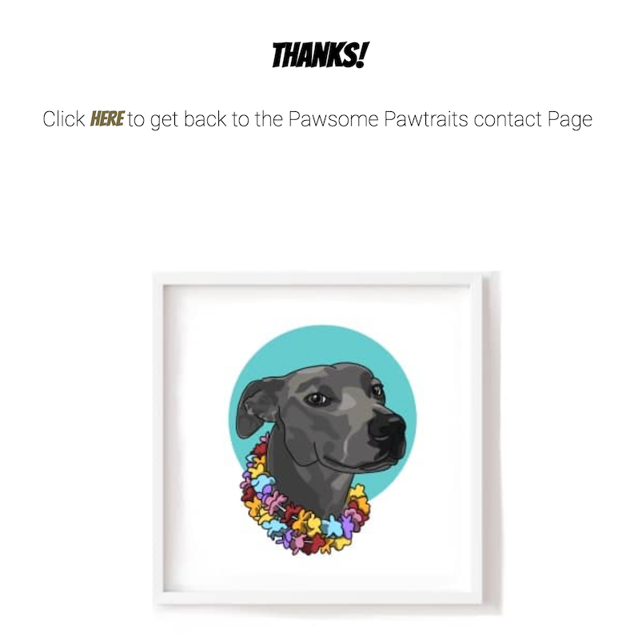

### Future Features

- A feature within the main gallery allowing the users to view the photos individually when clicked on, with zoom capabilities. 
- An online shop containing a price list, gallery and options to have your portrait printed on a t-shirt or mugs etc.
- A multi media blog containing images, text entries and video so that Craig can communicate his process, musings and inspiration in real time. This blog however must be easy for Craig to update without the developer. This will also require a small amendment to the navbar. 
- I would personally like to experiment with building this site as a one page site. 

***

## Technologies Used

- [HTML5](https://html.spec.whatwg.org/) - provides content and structure 
- [CSS](https://www.w3.org/Style/CSS/Overview.en.html) - provides styling 
- [Balsamiq](https://balsamiq.com/) - for wireframes
- [Procreate](https://procreate.art/) - for manipulating images
- [coolors.co](https://coolors.co/d3ab9e-eac9c1-ebd8d0-fffbff-fefeff) - the colour scheme was inspired by colours generated here 
- [Font Awesome](https://fontawesome.com/) - multiple icons implemented throughout the site from font awesome version 5
- [Google Fonts](https://fonts.google.com/) - Both fonts used in the website imported from here 
- [Chrome Dev Tools](https://developer.chrome.com/docs/devtools/) - used extensively to experiment with grid, flexbox and general responsiveness. 
- [Gitpod](https://www.gitpod.io/) - used to used to create and host the website
- [Github](https://github.com/) - used to deploy the website 
- [Multi Device Mock Up Generator](https://techsini.com/multi-mockup/) - to create an image displaying the home page on various devices 

## Testing

Please refer [**_here_**](TESTING.md) for more information on testing of the Pawsome Portraits website. 

<!-- add link and create new doc re testing -->

The site was deployed to GitHub pages. 

### Deployment Instructions

#### Deploy to GitHub Pages

1. Navigate to the settings tab in the GitHub repository 
2. Once in settings, navigate to the pages tab on the left of the page 
3. Under source, select branch ‘master’ and then click ‘save’
4. page will no automatically refresh and show a detailed ribbon display to indicate deployment 

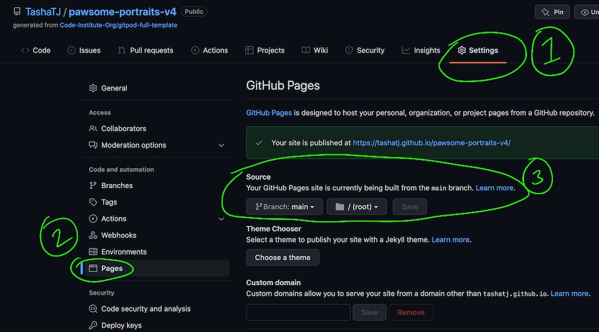

### To Fork the Repository 

To make a copy or ‘fork’ the repository - 

1. Log into GitHub and locate repository 
2. On the right hand side of the page select the ‘fork’ option to create and copy of the original

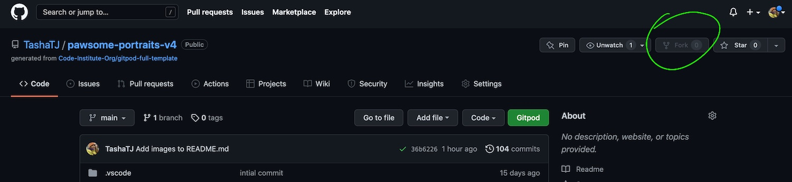

### To create a Local Clone 

1. under the repository name, click on the ‘code’ tab 
2. in the clone box, HTTPS tab, click on the clipboard icon 
3. in your IED open GitBash 
4. Changed the current working directory to the location you want the cloned directory to be made
5. Type ‘git clone’ and then paste the URL copied from GitHub
6. press enter and the local clone will be created 

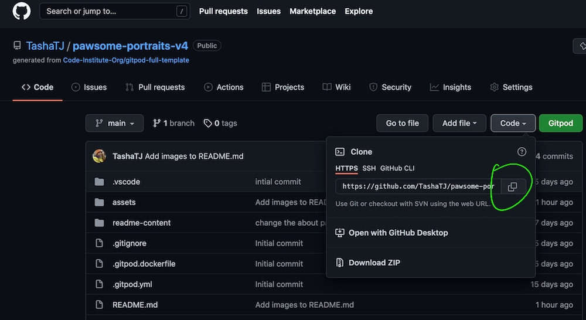

## Credits 

### Content 
- The hamburger menu was inspired by a youtube [tutorial](https://youtu.be/uugicVDUzMA)
- The image gallery was inspired by this youtube [tutorial](https://www.youtube.com/watch?v=rnhoY5Cdmy0)
- The sticky footer was inspired by this [tutorial](
https://webdesign.tutsplus.com/tutorials/how-to-build-a-responsive-multi-level-sticky-footer-with-flexbox--cms-33341?_ga=2.55476395.1460857226.1647778214-1349846198.1645535117) 
- Many issues were at least partly resolved by searching [Stack Overflow](https://stackoverflow.com/)  
- Ger, a CI mentor helped with my understanding of a responsive css nav bar. 
- Inspiration for the README.md came from [Dave Horrick's repository](https://github.com/DaveyJH/ci-portfolio-one-v4/blob/main/README.md) 

***

### Media 
All photos and the rights to them are owned by the artist [Craig Antony Kelly](https://www.craiganthonykelly.co.uk/), who gave his full permission for use in this website.

## Acknowledgements 
This website was executed and completed as a portfolio 1 Project for the full stack diploma at [Code Institute](https://codeinstitute.net/). 
I would like to firstly thank my mentor, Precious Ljege for his guidance, Robbie White for his patience and time, and Craig Antony Kelly for allowing me the pleasure of presenting his work. Also a big thanks goes to Kera Cudmore and Ken Sheridan, fellow students at Code Institute, for participating in the peer code review. 
Pawsome Portraits is a real concept, but the website is purely for the sake of the developer's portfolio and not for public consumption. 

Tasha Taylor Johnson, 2022.

 

