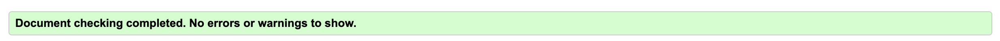
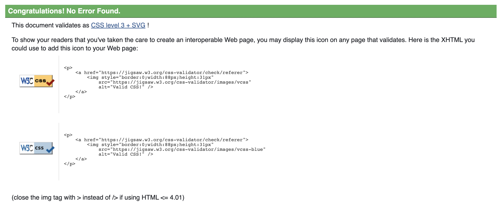
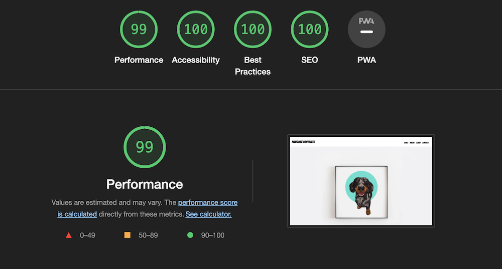
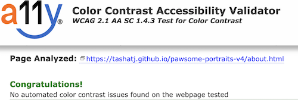
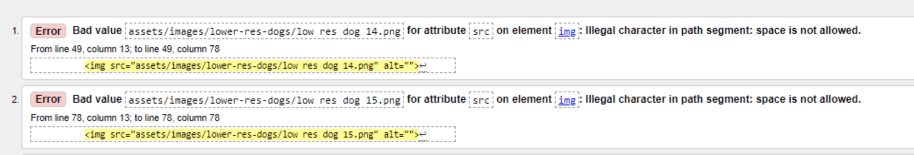
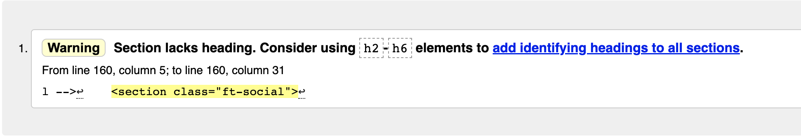
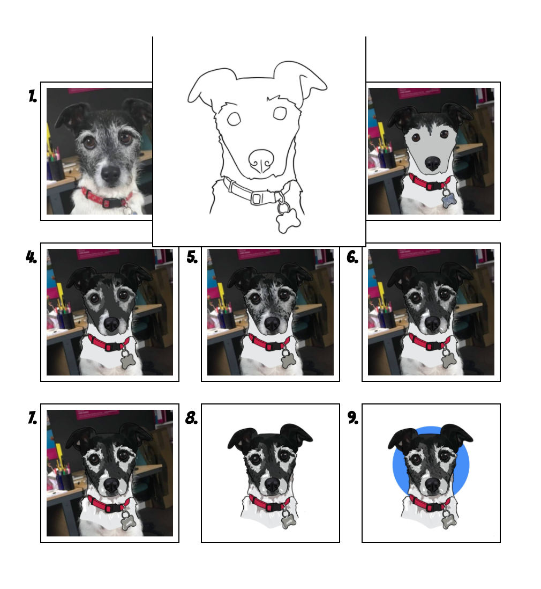

# Testing 

The Pawsome Pawtraits site has been tested in the following ways -

- [Code Validation](#code-validation)
    - [W3C HTML Validator](#w3c-html-validator) 
    - [W3C CSS Validator](#w3c-css-validator)
- [Lighthouse](#lighthouse)
- [Responsiveness](#responsiveness)
- [A11y Color Contrast Accessibility Checker](#a11y-color-contrast-accessibility-checker)
- [Browser Compatibility](#browser-compatibility)
- [Testing User Stories](#testing-user-stories)
- [Peer Review](#peer-review)
- [Bugs](#bugs)
    - [Resolved](#resolved)
    - [Unresolved](#unresolved)

## Code Validation 

### W3C HTML Validator

Home Page

Gallery Page

About Page

Learn Page

Contact Page

Form Destination Page

### W3C CSS Validator 

All pages passed the CSS validator without error. 

## Lighthouse 

I Used Lighthouse in Chrome Developer Tools to test each of the pages for:

- Performance - How the page performs whilst loading.
- Accessibility - How accessible is the site for all users and how can it be improved.
- Best Practices - How does the site conform to industry best practices.
- SEO - Search engine optimisation. Is the site optimised for search engine result rankings.

After some below 90 scores on initial mobile tests, I compressed the site images and re-tested each page. On these secondary tests, no score came below 94.

- as an example, the results for the Pawsome Pawtraits Home Page for both Mobile & Desktop are below.

## Responsiveness 

Responsive design tests were carried out manually using [Google Chrome DevTools](https://developer.chrome.com/docs/devtools/) and then toying with different devices including iphone13, 12, 11, Ipad Pro, Airbook, Macbook and Galaxy Note 8.

On wide display types the contents of the site are restricted in width to 2000px. This helps the UX by not spreading the content too wide on the extra wide screens.

## A11y Color Contrast Accessibility Checker

Colour contrast tests were carried out across the website and all came back without issue. 

## Browser Compatibility

The site was tested on Google Chrome, Microsoft Edge, Safari and Mozilla Firefox, with no visible issues for the user. Appearance, functionality and responsiveness were consistent throughout for a range of device sizes and browsers.

## Testing User Stories 

- Understand the purpose of the site on loading

    - The play on words Logo, 'Pawsome Pawtraits' and large Hero image of a hanging dog portrait gives the user an immediate understanding of what the site's main subject is. 

- Navigate through the site smoothly

    - The pages can be accessed in the same way on every page, via a very simply navigational menu, which highlights what page is active by a gold colour change. 

- See lots of examples of artworks

    - There is an extensive second page gallery and then numerous artworks articulating the other pages that the user can browse at leisure. 

- be able to contact Craig easily

    - Craig's contact details appear on a clearly defined 'Contact' page, both via a direct contact form, and then location details below. 
    - Social media links are also apparent on each page as a secondary means of contact. 

- Learn more about Craig's process and perhaps learn some skills myself

    - The learn pages contains a section which breaks down Craig's process for the user, and 3 helpful videos to describe visually how to complete your own portrait.

- Connect with Craig on social media 

    - Social media links appear in the footer on every page without exception. They change colour on hover so the user knows where to go. 

- Learn more about the developer who created the site

    - The developer links also lie in the footer, after Craig's, should the user be curious to visit.

## Peer Review

Prior to launch, the site was submitted for Peer Review by fellow students and alumni at [Code Institute](https://codeinstitute.net/) and also some individuals outside the software development world. Feedback included issues with responsiveness and layout issues, both of which were solved with some minor css adjustments. 

## Bugs

### Resolved

During validation the following bugs occurred.

Both were oversights in the building process and were easily rectified by changing the incriminating file names to spaceless ones and changing the section tag to a div. 

### Unresolved

There is a bug in the learn page which is a sizing and overflow issue, which had I more time I would solve by more experimentation with the current code. 

Back to the [README.md](./README.md#testing)