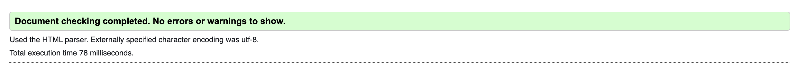

# Testing 

The Pawsome Pawtriats site has been tested in the following ways -

- [Code Validation](#code-validation)
    - [W3C HTML Validator](#w3c-html-validator) 
    - [W3C CSS Validator](#w3c-css-validator)
- [Lighthouse](#lighthouse)
- [Responsiveness](#responsiveness)
- [A11y Color Contrast Accessibility Checker](#a11y-color-contrast-accessibility-checker)
- [Browser Compatibility](#browser-compatibility)
- [Peer Review](#peer-review)
- [Bugs](#bugs)
    - [Resolved](#resolved)
    - [Unresolved](#unresolved)

## Code Validation 

### W3C HTML Validator

### W3C CSS Validator 

## Lighthouse 

## Responsiveness 

Responsive design tests were carried out manually using [Google Chrome DevTools](https://developer.chrome.com/docs/devtools/) and then toying with different devices including iphone13, 12, 11, Ipad Pro, Airbook, Macbook and Galaxy Note 8.

On wide display types the contents of the site are restricted in width to 2000px. This helps the UX by not spreading the content too wide on the extra wide screens.

## A11y Color Contrast Accessibility Checker

## Browser Compatibility

The site was tested on Google Chrome, Microsoft Edge, Safari and Mozilla Firefox, with no visible issues for the user. Appearance, functionality and responsiveness were consistent throughout for a range of device sizes and browsers.

## Peer Review

Prior to launch, the site was submitted for Peer Review by fellow students and alumni at [Code Institute](https://codeinstitute.net/) and also some individuals putside the software development world. Feedback included issues with responsiveness and layout issues, both of which were solved with some minor css adjustments. 

## Bugs

### Resolved

During validation the following bugs occurred.

Both were oversights in the building process and were easily rectified by changing the incriminating file names to spaceless ones and changing the section tag to a div. 

### Unresolved

There is a bug in the learn page which is a sizing and overflow issue, which had I more time I would solve by more experimentation with the current code. 

Back to the [README.md](./README.md#testing)